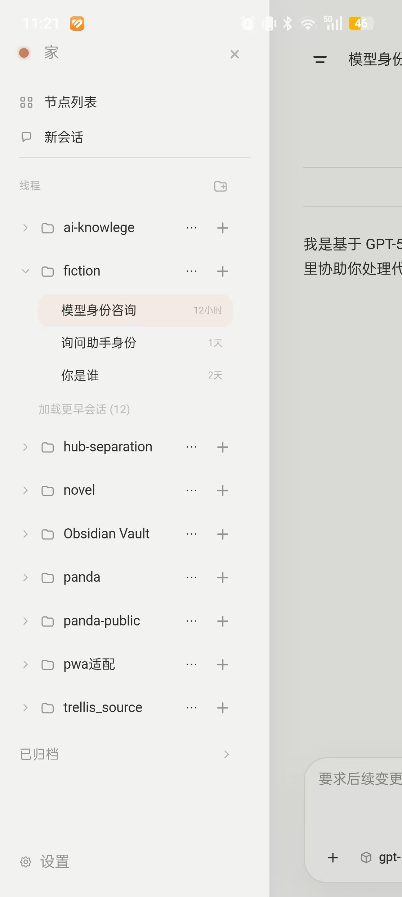
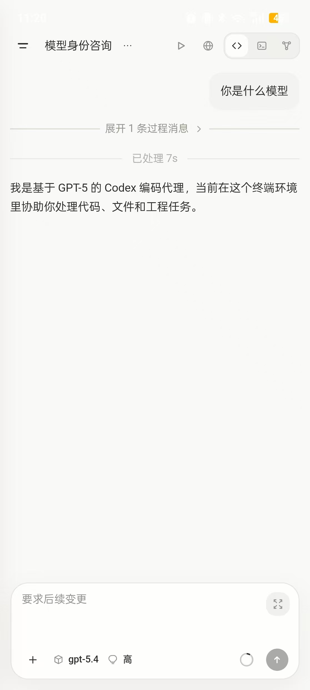

# Panda

Panda 是一个给手机和桌面浏览器使用的远程控制入口，用来连接你的 AI 编码环境。

它主要包含两个部分：

- `Hub`：提供 Web 界面，手机扫码后打开的就是它
- `Agent`：连接本机或远程的 AI 编码会话、终端和项目

Panda 同时提供移动端访问体验。

- 当前已经提供可直接安装的 Android APK
- iOS 端暂不提供现成安装包，需要你自行编译

如果你只是想安装并用起来，按下面步骤操作即可。

## 界面预览

<p align="center">
  
  
  
  
  
</p>

## 环境要求

- 本机需要先安装 `Codex CLI`
- `Codex CLI` 不要和 `Panda` 安装在同一个环境里，建议分开使用独立环境，避免互相影响
- Node.js `20.19.0` 或更高版本
- npm
- 一种组网软件，用来给设备分配可互通的虚拟 IP

检查 `Codex CLI` 是否已安装：

```powershell
codex --version
```

如果终端能输出类似 `codex-cli 0.118.0` 的版本号，说明已经安装完成。

## 移动端 App

- Android：当前提供编译好的 APK，建议从 [GitHub Releases](https://github.com/xzm941012/panda/releases) 下载并安装
- iOS：当前不提供现成安装包，需要你自行编译
- Android 安装包可通过新版 APK 直接覆盖安装升级

## npm 安装

推荐直接安装总入口包：

```powershell
npm install -g @jamiexiongr/panda@latest --registry=https://registry.npmjs.org/
```

安装完成后可用命令：

```powershell
panda
```

如果你只想单独安装某一部分，也可以：

```powershell
npm install -g @jamiexiongr/panda-hub@latest --registry=https://registry.npmjs.org/
npm install -g @jamiexiongr/panda-agent@latest --registry=https://registry.npmjs.org/
```

## 运行步骤

README 统一按组网方案说明。

推荐启动方式是 `Hub` 和 `Agent` 运行在同一台机器上：

1. 启动 `Hub`

```powershell
panda hub
```

2. 在同一台机器上启动 `Agent`

```powershell
$env:PANDA_AGENT_NAME='家里的工作站'
$env:PANDA_GROUP_IP='你的组网虚拟IP'
panda agent
```

`PANDA_GROUP_IP` 表示组网软件分配给当前机器的组网虚拟 IP。
`PANDA_AGENT_NAME` 表示这个节点在 Panda 里的显示名称。

推荐使用以下组网软件：

- [Tailscale](https://tailscale.com/)
- [贝锐蒲公英](https://pgy.oray.com/)

这组命令表示：

- `Hub` 在本机启动 Panda Web 入口
- `Agent` 通过 `PANDA_GROUP_IP` 按组网方式注册到同一组里的 `Hub`
- `PANDA_GROUP_IP` 应填写当前机器在组网软件中的虚拟 IP

启动后，浏览器打开 `Hub` 地址即可进入 Panda。

## 常用命令

总入口安装后：

```powershell
panda hub
$env:PANDA_AGENT_NAME='家里的工作站'
$env:PANDA_GROUP_IP='你的组网虚拟IP'
panda agent
```

如果你安装的是单独包，对应命令为：

```powershell
panda-hub
panda-agent
```

## 常用默认端口

- `Hub` 默认端口：`4343`
- `Agent` 默认端口：`4242`

## 常见问题

### 1. 安装后找不到 `panda` 命令

先确认 npm 全局安装目录已经加入系统 `PATH`，然后重新打开终端再试。

### 2. 手机扫码后打不开页面

优先检查：

- `Hub` 是否还在运行
- 当前访问的是否是正确的 `Hub` 地址
- `Agent` 是否已经按相同组网配置启动

### 3. 页面能打开，但看不到 Agent

通常是 `Agent` 还没启动，或者 `PANDA_GROUP_IP` 配置不正确。

如果你使用了组网软件，优先确认当前填写的是该软件分配给本机的虚拟 IP，而不是普通局域网 IP。

## 更多说明

更完整的用户指南见：

- `docs/panda-user-guide.md`

npm 发布与包结构说明见：

- `docs/npm-release.md`
