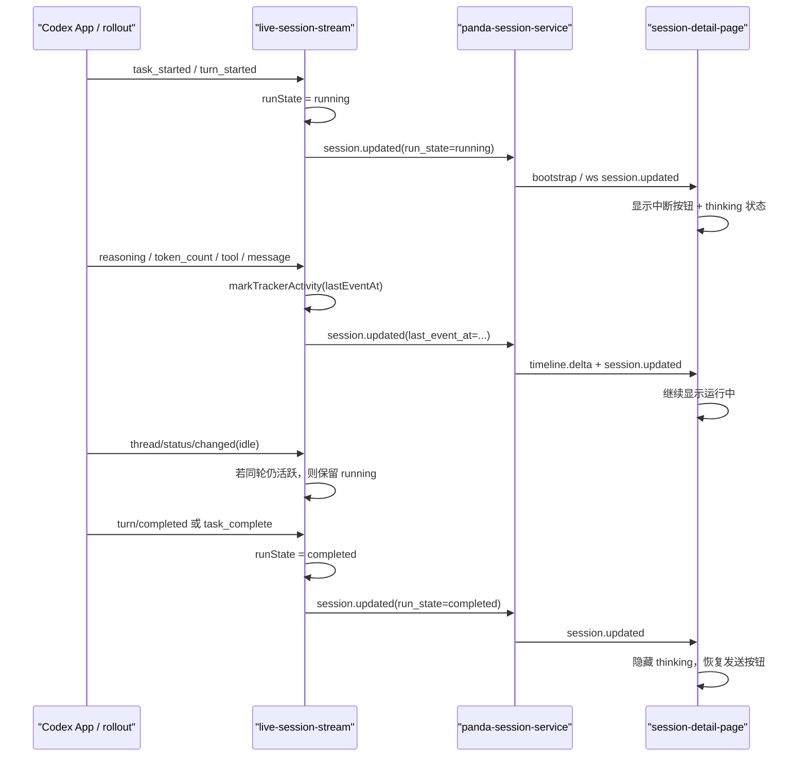

# Panda Codex 会话运行态链路

这份文档记录 Panda 在接入 Codex App 会话时，`run_state`、详情页“正在思考”、停止按钮、中断能力之间的真实链路，以及 2026-03-25 修复的一次真实故障。

## 1. 问题背景

用户在 2026-03-25 报告了一个稳定可复现的问题：

- 在 Codex App 发起的会话里，Panda 刚开始会显示运行中。
- 过一段时间后，详情页不再显示“正在思考”，提交按钮也从中断按钮变回发送按钮。
- 但时间线仍在持续追加 `reasoning`、`tool`、`assistant` 等内容。

用于排查的真实会话：

- 会话 ID：`019d2581-7878-7390-9fbb-2d6fe68d7cd3`
- 标题：`Add panda 局域网代理与上传`
- 关键时间：
  - `2026-03-25T15:00:57.801Z` 进入本轮处理
  - `2026-03-25T15:18:03Z` 到 `2026-03-25T15:19:52Z` 之间仍持续出现 `reasoning`、`function_call`、`custom_tool_call`、`token_count`
  - 旧逻辑下，同期 `/api/bootstrap` 已经把该会话返回为 `run_state: "idle"`

这说明问题不是“前端没刷新 timeline”，而是“运行态真相源和 timeline 活动事实分叉了”。

## 2. 设计目标

这一层的设计目标不是让 UI 更激进地猜测，而是保证：

- `run_state` 只由 provider 层产出。
- `bootstrap`、`ws session.updated`、`hydrateSession()`、历史 timeline 读取，对同一会话应给出一致的运行态。
- 前端只消费运行态，不再二次推理“既然还有输出那可能还在跑”。
- 运行态只能被明确终止事件，或者足够长时间的无活动，打回 `idle`。

## 3. 真实链路

### 3.1 数据源

Panda 里 Codex 会话运行态有三条相关链路：

1. 本地 rollout 文件读取
   - 文件：`~/.codex/sessions/.../rollout-*.jsonl`
   - 负责恢复历史 timeline、summary、context usage、基础 run state
   - 入口：`packages/provider-codex/src/index.ts`

2. live tracker
   - 负责追踪 rollout 尾部增量和 app-server 推送
   - 负责给 Panda 发 `session.updated`、`timeline.delta`、`plan.delta`
   - 入口：`packages/provider-codex/src/live-session-stream.ts`

3. Panda snapshot/bootstrap
   - `/api/bootstrap` 的 session 列表来自 discovery + managedSessions + live tracker patch 合并
   - 入口：`packages/provider-codex/src/panda-session-service.ts`

### 3.2 前端消费

前端详情页主要依赖两类输入：

- `session.run_state`
- `timeline`

相关显示点：

- “正在思考”条目：`apps/web/src/components/sessions/session-detail-page.tsx`
- 底部停止按钮：`apps/web/src/components/sessions/session-detail-page.tsx`
- 视觉旋转器：`apps/web/src/styles/details.css`

前端不应该自己重新定义“什么叫运行中”，否则 provider 与 UI 必然再次分叉。

## 4. 故障根因

这次实际存在两层问题。

### 4.1 根因一：provider 把 running 错误理解成“最近收到开始事件”

旧逻辑的关键判断是：

- `task_started`、`turn/started`、部分 app-server thread active 事件会把 `runStateChangedAt` 设为某个时间
- `normalizeRunState()` 用 `runStateChangedAt` 和固定 TTL 判断是否还算 `running`
- 但 `reasoning`、`function_call`、`custom_tool_call`、`custom_tool_call_output`、`token_count` 这些持续活动，并不会刷新 `runStateChangedAt`

结果就是：

- 同一轮处理仍在继续
- 但 `running` 只活在“开始那一刻”
- TTL 一过，`normalizeRunState()` 就把会话折叠成 `idle`

这正好命中了用户看到的现象：timeline 继续长，运行态却已经没了。

### 4.2 根因二：app-server 的 thread status 会短暂回报 idle

Codex app-server 在同一轮内部步骤之间，可能会短暂发出类似：

- `idle`
- `notLoaded`
- `waitingOnUserInput`

旧逻辑会把这些状态当作“这一轮已经结束”，直接把 tracker 切回 `idle`。

但真实情况是：

- 同一轮 turn 还没结束
- 只是线程状态在内部步骤之间短暂变化

所以这里只能把真正的 turn 终止信号视为结束，不能把中间过渡状态误判为结束。

### 4.3 前端层还有一个显示抑制问题

即使 provider 说会话还在 `running`，旧版详情页仍可能因为以下条件隐藏“正在思考”：

- 已经出现 assistant entry
- 最新 entry 不是特定 kind
- 已经有某类 thinking entry

这会让“有输出但看不到运行指示”继续发生。

这层不是根因，但会把体验问题放大。

## 5. 修复策略

修复遵守两个原则：

- 不引入新的前端猜测逻辑
- 不改变完成态、异常态、中断态的终止来源

### 5.1 运行态归一化改成看“最近活动时间”

live tracker 修复：

- 文件：`packages/provider-codex/src/live-session-stream.ts`
- 关键位置：
  - `markTrackerActivity`
  - `normalizeRunState`
  - `normalizeTrackerPatch`
  - `consumeRolloutRecord`

新规则：

- 只要会话仍处于 `running`
- 并且最近还有 rollout/app-server 活动事件
- 就不能因为“开始事件过去太久”而自动折叠成 `idle`

这里的“活动事件”包括：

- `reasoning`
- `message`
- `function_call`
- `function_call_output`
- `custom_tool_call`
- `custom_tool_call_output`
- `token_count`
- 其他 rollout 中持续追加的事件

### 5.2 thread/status/changed 只在真正结束时结束运行态

live tracker 修复：

- 文件：`packages/provider-codex/src/live-session-stream.ts`
- 关键位置：`applyThreadPayloadToTracker`

新规则：

- 如果当前 tracker 仍是 `running`
- 并且还有活动 turn，或者最近仍有活动事件
- 那么 `idle/notLoaded/waitingOnUserInput` 只能视为中间态
- 不能直接把 `run_state` 改成 `idle`

真正的结束仍然依赖：

- `task_complete`
- `turn/completed`
- 明确中断
- 长时间完全无活动后的超时折叠

### 5.3 历史读取链路也同步修复

历史 timeline 读取修复：

- 文件：`packages/provider-codex/src/index.ts`
- 关键位置：
  - `normalizeRunState`
  - `readCodexTimelineDetails`

新规则：

- 读取历史 rollout 时，除了 `lastRunStateChangedAt`
- 也记录 `lastActivityAt`
- 对 `running` 的归一化使用两者中更新的那个时间

这样 `readCodexTimelineDetails()` 与 live tracker 的判定语义一致，不会出现：

- live hydrate 说 `running`
- bootstrap discovery 说 `idle`

### 5.4 前端只做状态消费，不再做强抑制

前端修复：

- 文件：`apps/web/src/components/sessions/session-detail-page.tsx`
- 文件：`apps/web/src/styles/details.css`

收敛点：

- 打开一个已经在运行的附着会话时，立即同步 `isTurnBusy`
- 停止按钮直接认可 `session.run_state === 'running'`
- “正在思考”不再因为已经有 assistant entry 就被隐藏
- 视觉上使用真实旋转器，而不是仅靠文案

## 6. 时序图

## 7. 这次修复覆盖了什么

已经验证的场景：

1. 真实会话 `019d2581-7878-7390-9fbb-2d6fe68d7cd3`
   - 将 rollout 截断到 `task_complete` 之前
   - `readCodexTimelineDetails()` 返回 `running`
   - `hydrateSession().sessionPatch` 返回 `run_state: "running"`

2. 临时验证会话 `019d259b-539a-71c3-84a3-726fc6209b34`
   - `/api/bootstrap` 在运行中返回 `run_state: "running"`
   - 浏览器实际页面出现：
     - `thinking-status-pill`
     - 工具条 `is-running`
     - 提交区中断按钮

3. 工程校验
   - `corepack pnpm typecheck`
   - `corepack pnpm build`

## 8. 后续约束

后面再改这块时，必须保持下面几个约束：

1. `run_state` 的真相源在 provider，不在前端。
2. `bootstrap`、`hydrateSession`、本地 timeline 读取，必须共享同一套运行态语义。
3. 只要同一轮还有持续活动事件，就不能因为 thread status 的短暂回摆而提前退回 `idle`。
4. `completed` 和 `idle` 不能合并使用。
   - `completed` 表示刚结束，允许短暂保留
   - `idle` 表示当前没有运行中的轮次
5. 前端可以决定如何展示运行态，但不能重新定义运行态。

## 9. 回归检查清单

每次改动以下任意模块前后，都应该跑一遍：

- `packages/provider-codex/src/live-session-stream.ts`
- `packages/provider-codex/src/index.ts`
- `packages/provider-codex/src/panda-session-service.ts`
- `apps/web/src/components/sessions/session-detail-page.tsx`

建议最少检查：

1. 新建一个 managed 会话，确认开始时显示运行中。
2. 让会话执行一个超过 10 分钟或可持续输出的长任务，确认运行中不会中途消失。
3. 确认 `turn/completed` 或 `task_complete` 后，运行态能收敛到 `completed` 再回到 `idle`。
4. 确认 interrupt 后按钮和状态同步恢复。
5. 确认附着到已有 Codex App 会话时，进入详情页也能立刻显示正确运行态。

## 10. 相关文件

- `packages/provider-codex/src/live-session-stream.ts`
- `packages/provider-codex/src/index.ts`
- `packages/provider-codex/src/panda-session-service.ts`
- `apps/web/src/components/sessions/session-detail-page.tsx`
- `apps/web/src/styles/details.css`
